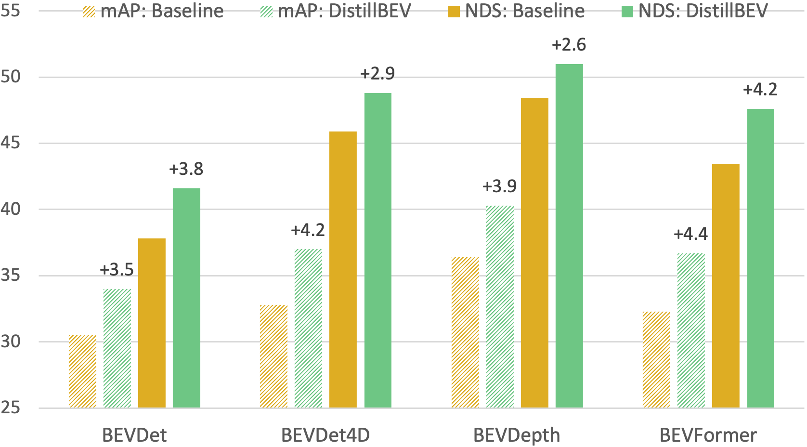

## DistillBEV: Boosting Multi-Camera 3D Object Detection with Cross-Modal Knowledge Distillation

  

[Zeyu Wang](https://zw615.github.io/), [Dingwen Li](https://sites.google.com/site/dingwenli93), [Chenxu Luo](https://chenxuluo.github.io/), [Cihang Xie](https://cihangxie.github.io/), [Xiaodong Yang](https://xiaodongyang.org/)  
DistillBEV: Boosting Multi-Camera 3D Object Detection with Cross-Modal Knowledge Distillation, ICCV 2023  

Coming soon
