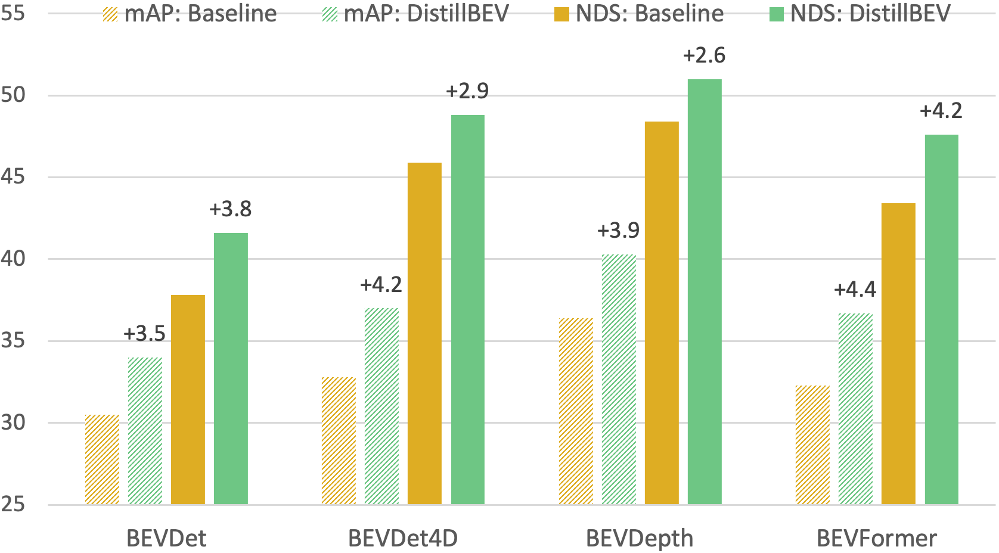

## DistillBEV: Boosting Multi-Camera 3D Object Detection with Cross-Modal Knowledge Distillation
<p align='left'>
  
</p>

[Zeyu Wang](https://zw615.github.io/), [Dingwen Li](https://sites.google.com/site/dingwenli93), [Chenxu Luo](https://chenxuluo.github.io/), [Cihang Xie](https://cihangxie.github.io/), [Xiaodong Yang](https://xiaodongyang.org/) <br>
[DistillBEV: Boosting Multi-Camera 3D Object Detection with Cross-Modal Knowledge Distillation](https://arxiv.org/pdf/2309.15109.pdf), ICCV 2023 <br>

## Get Started

### Installtion
Please refer to [INSTALL](docs/INSTALL.md) to set up the environment and install the dependencies (see more details in [Dockerfile](docker/Dockerfile)).

### Data Preparation
Please follow the instructions in [DATA](docs/DATA.md).

### Training and Evaluation
Please follow the instructions in [RUN](docs/RUN.md).

## Main Results

BEVDepth and BEVFormer are respectively used in this repo as CNNs and Transformers based students to exemplify the improvement by DistillBEV. 

* Backbone: ResNet-50 pre-trained on ImageNet-1K 

| Teacher | Student | mAP | NDS | Checkpoints |
| ------- | ------- | --- | --- | ----------- |
| - | BEVDepth | 36.4	| 48.4 | [[Google Drive](https://drive.google.com/file/d/16KAze3E1XHZBA1_JMWtu6tozIgVetCzD/view?usp=sharing)] [[Baidu Cloud](https://pan.baidu.com/s/1pxT4azQya79BDO-iSIiu7Q?pwd=cm65)] |
| CenterPoint | BEVDepth | 39.0	| 50.6 | [[Google Drive](https://drive.google.com/file/d/1zoxNjrJwXbigcpgtMd9KjjS3vZ2eFC-e/view?usp=sharing)] [[Baidu Cloud](https://pan.baidu.com/s/18y1U6lsTWK1sucipLxinDg?pwd=evci)] |
| MVP | BEVDepth | 40.3	| 51.0 | [[Google Drive](https://drive.google.com/file/d/1xNl7yw5Kpcv1vhT-B2bK5DNXSmKHdL9a/view?usp=sharing)] [[Baidu Cloud](https://pan.baidu.com/s/1sIYgJrads8GGLKXPXrWFWA?pwd=9u7v)] |

| Teacher | Student | mAP | NDS | Checkpoints |
| ------- | ------- | --- | --- | ----------- |
| - | BEVFormer | 32.3 | 43.4 | [[Google Drive](https://drive.google.com/file/d/1XSOR8xClMsWfTAlXfOnb1ayU-YGSt6Gh/view?usp=sharing)] [[Baidu Cloud](https://pan.baidu.com/s/1odedSKeEQ2BuXNZU-If9Iw?pwd=jxn2)] |
| CenterPoint | BEVFormer | 35.9 | 46.8 | [[Google Drive](https://drive.google.com/file/d/1gTOTjH279HVkTUqKbHn9b4kF2MscT2Rg/view?usp=sharing)] [[Baidu Cloud](https://pan.baidu.com/s/1gp4uAVK5ITnUrx9QIaNWzA?pwd=w8gp)] |
| MVP | BEVFormer | 36.7 | 47.6 | [[Google Drive](https://drive.google.com/file/d/1duXWz4IkFyqzBuT7bmdNtrTVqSaiOC6J/view?usp=sharing)] [[Baidu Cloud](https://pan.baidu.com/s/1eTEkNPxJQg353LYKqP5jZA?pwd=2487)] |

* Backbone: ResNet-101 pre-trained on ImageNet-1K

| Teacher | Student | mAP | NDS | Checkpoints |
| ------- | ------- | --- | --- | ----------- |
| - | BEVDepth | 40.7	| 52.2 | [[Google Drive](https://drive.google.com/file/d/1uc4TeEv-W6JdHD2W_gT1M_6mcI76sSx0/view?usp=sharing)] [[Baidu Cloud](https://pan.baidu.com/s/1VEEB1-DUxN9pACmmEMYKnw?pwd=9v4a)] |
| CenterPoint | BEVDepth | 43.6 | 53.6 | [[Google Drive](https://drive.google.com/file/d/1xUPu9J8S3DlqGa1nE9BmTlzNwwZgjlR2/view?usp=sharing)] [[Baidu Cloud](https://pan.baidu.com/s/1kLYMvBiH9nrCbUsZS57GFg?pwd=5c94)] |
| MVP | BEVDepth | 45.0 | 54.6 | [[Google Drive](https://drive.google.com/file/d/1VyrNGNGXj1q6APUZyhCxIgUpXHX6xepY/view?usp=sharing)] [[Baidu Cloud](https://pan.baidu.com/s/1leiZlMlltKnH_mADpaLZVA?pwd=jwc5)] |

| Teacher | Student | mAP | NDS | Checkpoints |
| ------- | ------- | --- | --- | ----------- |
| - | BEVFormer | 34.9 | 46.0 | [[Google Drive](https://drive.google.com/file/d/1d30ZQHRnFutGS20AgisRjIDQx2ixUSrd/view?usp=sharing)] [[Baidu Cloud](https://pan.baidu.com/s/1UtDi9Sz4dbxljzgx1af2rw?pwd=h32f)] |
| CenterPoint | BEVFormer | 37.4 | 48.2 | [[Google Drive](https://drive.google.com/file/d/1yL5JohUW2s5qnhu4SYeD7QLZhBq1ldHJ/view?usp=sharing)] [[Baidu Cloud](https://pan.baidu.com/s/1RWz-Het9eM0uNhJqCCqjYw?pwd=wdrc)] |
| MVP | BEVFormer | 38.2 | 49.1 | [[Google Drive](https://drive.google.com/file/d/11Ri8NOMCGG3MSsfZQLkM6XW8kRwc5SzV/view?usp=sharing)] [[Baidu Cloud](https://pan.baidu.com/s/1wSUIVV_sxrMpTa1q7TAaIw?pwd=9axy)] |

## Citation
Please cite the following paper if this repo helps your research: <br>
```
@InProceedings{Wang_2023_ICCV,
    author    = {Wang, Zeyu and Li, Dingwen and Luo, Chenxu and Xie, Cihang and Yang, Xiaodong},
    title     = {DistillBEV: Boosting Multi-Camera 3D Object Detection with Cross-Modal Knowledge Distillation},
    booktitle = {IEEE/CVF International Conference on Computer Vision (ICCV)},
    year      = {2023},
}
```

## Acknowledgement
We thank the authors for the multiple great open-sourced repos, including [MMDetection3D](https://github.com/open-mmlab/mmdetection3d), [CenterPoint](https://github.com/tianweiy/CenterPoint), [BEVDet](https://github.com/HuangJunJie2017/BEVDet), [BEVDepth](https://github.com/Megvii-BaseDetection/BEVDepth) and [BEVFormer](https://github.com/fundamentalvision/BEVFormer).

## License
Copyright (C) 2023 QCraft. All rights reserved. Licensed under the [CC BY-NC-SA 4.0](https://creativecommons.org/licenses/by-nc-sa/4.0/legalcode) (Attribution-NonCommercial-ShareAlike 4.0 International). The code is released for academic research use only. For commercial use, please contact business@qcraft.ai.
